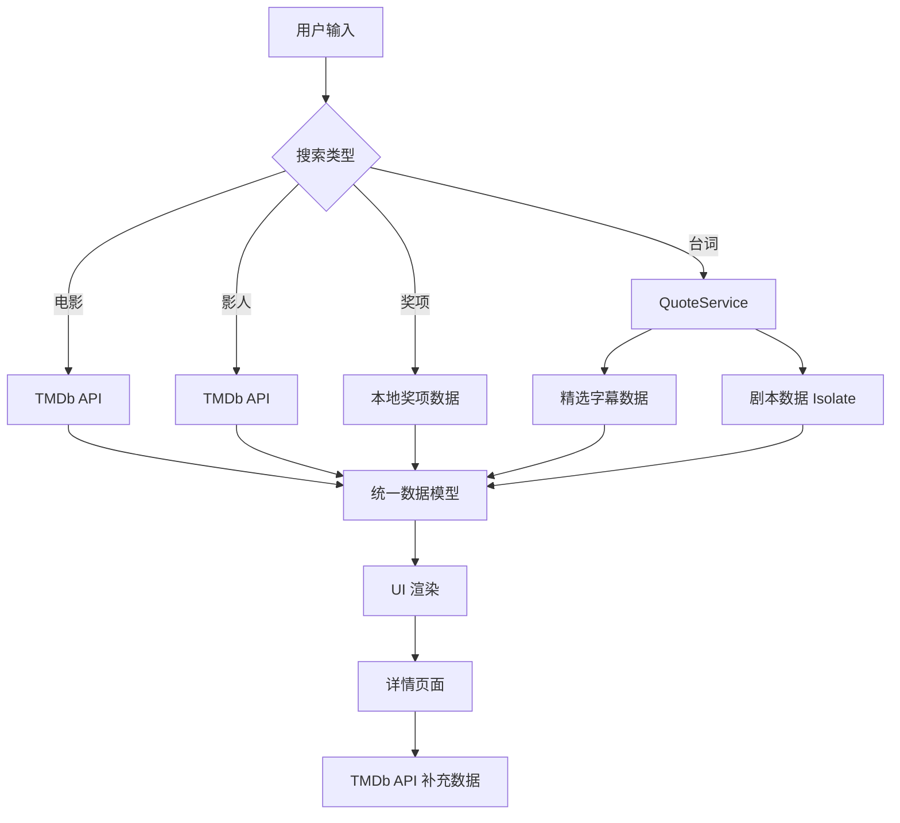

# MovieMind 项目技术报告

**项目名称**：MovieMind  
**开发框架**：Flutter (Dart)  
**报告日期**：2025-12-11  
**当前版本**：1.0.0+1

---

## 1. 项目概述 (Overview)

**MovieMind** 是一款跨平台的电影探索与管理应用。它旨在为电影爱好者提供一个集 **影片查询**、**影人检索**、**电影奖项查询** 以及 **经典台词/剧本搜索** 于一体的综合平台。除了基础的信息浏览，应用还提供了个性化的 **观影管理** 功能（如收藏、观看进度记录、个人影评笔记）。

---

## 2. 技术栈架构 (Tech Stack)

### 2.1 核心框架
- **Flutter & Dart**: 采用 Google 的 Flutter 框架进行开发，实现一套代码多端运行（iOS, Android, Web, Desktop）。
- **架构模式**: 采用分层架构 (Layered Architecture)，主要分离为：
  - **UI Layer (Presentation)**: 页面 (`pages/`) 与通用组件 (`widgets/`)。
  - **Service Layer (Business Logic)**: 业务逻辑处理 (`services/`)。
  - **Model Layer (Data)**: 数据实体定义 (`models/`)。

### 2.2 关键依赖库 (Dependencies)
- **网络请求**: `dio` - 处理与 TMDb API 的 HTTP 请求。
- **图片缓存**: `cached_network_image` - 优化海报、剧照的加载体验与内存管理。
- **本地存储**: `shared_preferences` - 用于持久化用户的收藏、观影状态及笔记数据。
- **视频播放**: `video_player`, `chewie`, `youtube_player_iframe` - 实现预告片播放功能。
- **UI 增强**: `google_fonts` (字体), `flutter_rating_bar` (评分组件), `carousel_slider` (轮播图)。
- **异步计算**: Flutter `foundation` (Isolate/Compute) - 用于处理大规模文本数据的后台搜索。

---

## 3. 核心功能模块 (Core Modules)

### 3.1 超级搜索模块 (`SearchPage`)
这是应用的核心入口，支持多种维度的检索：
- **多类型支持**: 通过 `Enum` 管理 `SearchType` (Movie, Person, Awards, Quote)。
- **电影搜索**: 接入 TMDb Search API，支持按相关度、评分、上映日期排序。
- **影人搜索**: 查询演员/导演，展示头像及相关作品。
- **奖项搜索**: 依托本地数据集，支持查询奥斯卡、戛纳等电影节获奖情况。
- **台词/剧本搜索 (新增亮点)**:
  - **数据源**: 整合了精选字幕 (`33_subtitles_data_with_tmdb.json`) 和全量剧本 (`movie_scripts_with_tmdb.json`)。
  - **双引擎搜索**: 优先快速匹配精选字幕；对于长尾关键词，启动后台 `Isolate` 线程检索 300MB+ 的剧本数据，确保 UI 不卡顿。
  - **高亮展示**: 搜索结果通过 `RichText` 自动高亮匹配关键词，支持中英双语台词展示及时间轴显示。

### 3.2 电影详情模块 (`MovieDetailPage`)
- **信息聚合**: 动态计算 `Appbar` 透明度，沉浸式展示电影海报、背景图。
- **数据关联**: 展示演职人员 (`Cast`)、剧照 (`Images`)、推荐电影 (`Recommendations`)。
- **交互功能**:
  - **播放预告**: 自动检索并播放 YouTube 关联视频。
  - **观影状态**: 状态机管理（想看/在看/看过），其中"在看"状态支持滑动条记录百分比进度。
  - **笔记系统**: 支持用户撰写并本地保存个人影评。

### 3.3 数据服务层 (`Services`)
- **`TMDbService`**: 封装所有外部 API 调用，处理 JSON 序列化与异常。
- **`StorageService`**: 封装本地存储逻辑，管理 JSON 格式的用户数据（如自定义片单）。
- **`QuoteService`**: 专用于处理台词检索。
  - *优化策略*: 实现了 `compute` 函数调用，将耗时的 JSON 解析和字符串匹配任务放入后台隔离线程，解决了大文件搜索导致的界面冻结问题。
  - *数据映射*: 实现了从本地数据集 ID (`tmdb_id`) 到在线 API 数据的映射，确保本地搜索结果能跳转至完整的详情页。

---

## 4. 详细技术实现 (Technical Implementation Details)

### 4.1 应用架构设计

#### 4.1.1 主应用入口 (`main.dart`)
```dart
class MovieMindApp extends StatelessWidget {
  @override
  Widget build(BuildContext context) {
    return MaterialApp(
      theme: ThemeData(
        scaffoldBackgroundColor: const Color(0xFFF5F5F7),
        primaryColor: Colors.black,
        useMaterial3: true,
        fontFamily: 'San Francisco',
      ),
      home: const MainScreen(),
    );
  }
}
```

应用采用 **Material Design 3** 设计语言，配置了统一的主题色彩方案：
- **背景色**: `#F5F5F7` (苹果风格的浅灰色)
- **主色调**: 黑色系，营造专业电影应用的视觉感受
- **字体**: San Francisco 系统字体，确保跨平台一致性

#### 4.1.2 底部导航架构
```dart
class MainScreen extends StatefulWidget {
  int _currentIndex = 0;
  final List<Widget> _pages = [
    const HomeTab(),      // 首页推荐
    const SearchPage(),   // 搜索页面
    const MyMoviesPage(), // 我的电影
    const ProfilePage(),  // 个人资料
  ];
}
```

采用 `PageView` + `BottomNavigationBar` 的经典架构，支持手势滑动切换页面。

### 4.2 数据层实现

#### 4.2.1 TMDb API 服务 (`TMDbService`)
```dart
class TMDbService {
  static const String apiKey = '9d5a5768705c19907badb63abbb20821';
  static const String baseUrl = 'https://api.themoviedb.org/3';
  
  late final Dio _dio;
  
  TMDbService() {
    _dio = Dio(BaseOptions(
      baseUrl: baseUrl,
      connectTimeout: const Duration(seconds: 5),
      receiveTimeout: const Duration(seconds: 5),
      queryParameters: {
        'api_key': apiKey,
        'language': 'zh-CN',
      },
    ));
    _dio.interceptors.add(LogInterceptor());
  }
}
```

**核心特性**:
- **统一配置**: 所有请求自动携带 API Key 和中文语言参数
- **超时控制**: 连接和接收超时均设为 5 秒，避免长时间等待
- **日志拦截**: 开发环境下自动记录请求日志，便于调试
- **错误处理**: 实现了完整的异常捕获机制

**主要 API 封装**:
```dart
// 电影相关
Future<List<Movie>> getNowPlaying() => _getMovies('/movie/now_playing');
Future<List<Movie>> getPopular() => _getMovies('/movie/popular');
Future<Movie?> getMovieDetail(int movieId) async { /* ... */ }

// 搜索相关
Future<List<Movie>> searchMovies(String query) async { /* ... */ }
Future<List<Person>> searchPeople(String query) async { /* ... */ }

// 发现相关
Future<List<Movie>> discoverMovies({int? genreId, String? region}) async { /* ... */ }
```

#### 4.2.2 本地存储服务 (`StorageService`)
```dart
class StorageService {
  static const String _favoritesKey = 'favorites';
  static const String _watchStatusKey = 'watch_status';
  static const String _notesKey = 'notes';
  
  Future<bool> toggleFavorite(Movie movie) async {
    final prefs = await SharedPreferences.getInstance();
    List<String> favorites = prefs.getStringList(_favoritesKey) ?? [];
    
    final movieJson = jsonEncode(movie.toJson());
    if (favorites.contains(movieJson)) {
      favorites.remove(movieJson);
      await prefs.setStringList(_favoritesKey, favorites);
      return false;
    } else {
      favorites.add(movieJson);
      await prefs.setStringList(_favoritesKey, favorites);
      return true;
    }
  }
}
```

**存储策略**:
- **JSON 序列化**: 将复杂对象序列化为 JSON 字符串存储
- **分类存储**: 不同类型数据使用不同的 Key 进行隔离
- **异步操作**: 所有存储操作均为异步，避免阻塞 UI 线程

### 4.3 台词搜索核心实现

#### 4.3.1 QuoteService 架构
```dart
class QuoteService {
  static final QuoteService _instance = QuoteService._internal();
  factory QuoteService() => _instance;
  
  Map<String, List<dynamic>>? _subtitleData;
  
  Future<void> init() async {
    if (_subtitleData != null) return;
    
    try {
      final String subtitleJson = await rootBundle.loadString(
        'assets/scripts/33_subtitles_data_with_tmdb.json'
      );
      final Map<String, dynamic> parsed = jsonDecode(subtitleJson);
      if (parsed['data'] != null) {
        _subtitleData = Map<String, List<dynamic>>.from(parsed['data']);
      }
    } catch (e) {
      debugPrint('Error loading subtitles: $e');
      _subtitleData = {};
    }
  }
}
```

**单例模式**: 确保全局只有一个 QuoteService 实例，避免重复加载数据。

#### 4.3.2 双引擎搜索算法
```dart
Future<List<QuoteMatch>> searchQuotes(String query) async {
  List<QuoteMatch> results = [];
  final lowerQuery = query.toLowerCase().trim();

  // 引擎1: 精选字幕数据搜索 (快速)
  if (_subtitleData != null) {
    _subtitleData!.forEach((keyword, matches) {
      bool keywordMatches = keyword.toLowerCase().contains(lowerQuery);
      
      for (var item in matches) {
        String content = item['subtitle_content'] ?? '';
        String contentZh = item['subtitle_content_zh'] ?? '';
        
        if (keywordMatches || 
            content.toLowerCase().contains(lowerQuery) || 
            contentZh.contains(lowerQuery)) {
          // 构建匹配结果
          results.add(QuoteMatch(/* ... */));
        }
      }
    });
  }

  // 引擎2: 剧本数据搜索 (深度)
  if (query.length >= 2) {
    final scriptResults = await _searchScriptsInIsolate(query);
    results.addAll(scriptResults);
  }

  return results;
}
```

**搜索策略**:
1. **优先级搜索**: 先搜索小文件 (3.6MB)，再搜索大文件 (308MB)
2. **条件触发**: 只有查询词长度 ≥2 时才启动深度搜索
3. **多字段匹配**: 同时匹配关键词、英文内容、中文内容

#### 4.3.3 Isolate 并发处理
```dart
Future<List<QuoteMatch>> _searchScriptsInIsolate(String query) async {
  final token = RootIsolateToken.instance;
  return await compute(_parseAndSearchScripts, {
    'query': query, 
    'token': token
  });
}

static Future<List<QuoteMatch>> _parseAndSearchScripts(
  Map<String, dynamic> params
) async {
  final query = params['query'] as String;
  final token = params['token'] as RootIsolateToken?;
  
  if (token != null) {
    BackgroundIsolateBinaryMessenger.ensureInitialized(token);
  }

  try {
    final String jsonString = await rootBundle.loadString(
      'assets/scripts/movie_scripts_with_tmdb.json'
    );
    final List<dynamic> data = jsonDecode(jsonString);
    // 执行搜索逻辑...
  } catch (e) {
    debugPrint('Isolate search error: $e');
    return [];
  }
}
```

**并发优化**:
- **Isolate 隔离**: 大文件处理在独立线程中进行
- **Token 传递**: 确保 Isolate 中能正常访问 Flutter 资源
- **异常隔离**: Isolate 中的异常不会影响主线程

### 4.4 UI 层关键实现

#### 4.4.1 关键词高亮算法
```dart
Widget _buildHighlightText(String text, String query, TextStyle style) {
  if (query.isEmpty) return Text(text, style: style);

  final lowerText = text.toLowerCase();
  final lowerQuery = query.toLowerCase();
  if (!lowerText.contains(lowerQuery)) return Text(text, style: style);

  final List<TextSpan> spans = [];
  int start = 0;
  int indexOfHighlight;

  while ((indexOfHighlight = lowerText.indexOf(lowerQuery, start)) != -1) {
    // 添加高亮前的普通文本
    if (indexOfHighlight > start) {
      spans.add(TextSpan(
        text: text.substring(start, indexOfHighlight), 
        style: style
      ));
    }
    
    // 添加高亮文本
    spans.add(TextSpan(
      text: text.substring(indexOfHighlight, indexOfHighlight + query.length),
      style: style.copyWith(
        color: Colors.redAccent, 
        fontWeight: FontWeight.bold
      ),
    ));
    
    start = indexOfHighlight + query.length;
  }

  // 添加剩余的普通文本
  if (start < text.length) {
    spans.add(TextSpan(text: text.substring(start), style: style));
  }

  return RichText(text: TextSpan(children: spans));
}
```

**算法特点**:
- **大小写不敏感**: 使用 `toLowerCase()` 进行匹配
- **多次匹配**: 支持同一文本中多个关键词高亮
- **样式保持**: 保持原有文本样式，仅对匹配部分应用高亮

#### 4.4.2 观影热度图组件 (`HeatmapGrid`)
```dart
class ContributionHeatmap extends StatelessWidget {
  final Map<DateTime, int> data;
  
  Widget _buildGrid(DateTime startDate, int columns, double boxSize, double margin) {
    return Row(
      children: List.generate(columns, (colIndex) {
        final weekStart = startDate.add(Duration(days: colIndex * 7));
        return Column(
          children: List.generate(7, (rowIndex) {
            final date = weekStart.add(Duration(days: rowIndex));
            final count = data[DateTime(date.year, date.month, date.day)] ?? 0;
            
            return Container(
              width: boxSize,
              height: boxSize,
              margin: EdgeInsets.all(margin),
              decoration: BoxDecoration(
                color: _getColor(count),
                borderRadius: BorderRadius.circular(1.5),
              ),
            );
          }),
        );
      }),
    );
  }
  
  Color _getColor(int count) {
    if (count == 0) return const Color(0xFFEEEEEE);
    if (count == 1) return const Color(0xFFFFE0B2);
    if (count <= 3) return const Color(0xFFFFB74D);
    if (count <= 5) return const Color(0xFFFF9800);
    return const Color(0xFFE65100);
  }
}
```

**实现特点**:
- **GitHub 风格**: 模仿 GitHub 贡献图的视觉设计
- **动态数据**: 根据观影频次动态调整颜色深度
- **时间轴**: 支持 53 周的时间跨度展示
- **响应式**: 支持水平滚动查看历史数据

### 4.5 数据模型设计

#### 4.5.1 Movie 模型的多态处理
```dart
class Movie {
  final int id;
  final String title;
  final String originalTitle;
  // ... 其他字段

  // 标准 API 数据解析
  factory Movie.fromJson(Map<String, dynamic> json) {
    return Movie(
      id: json['id'] ?? 0,
      title: json['title'] ?? json['original_title'] ?? '',
      // ...
    );
  }

  // 本地数据解析 (兼容不同字段名)
  factory Movie.fromLocalJson(Map<String, dynamic> json) {
    return Movie(
      id: json['id'] ?? json['tmdb_id'] ?? 0, // 关键兼容处理
      title: json['title'] ?? '',
      // ...
    );
  }
}
```

**设计亮点**:
- **多工厂方法**: 针对不同数据源提供专门的解析方法
- **字段兼容**: 处理 `id` vs `tmdb_id` 等字段差异
- **空值安全**: 所有字段都有默认值，避免空指针异常

### 4.6 性能优化实现

#### 4.6.1 图片缓存策略
```dart
// 在列表中使用
CachedNetworkImage(
  imageUrl: movie.fullPosterUrl,
  fit: BoxFit.cover,
  placeholder: (context, url) => Container(
    color: Colors.grey[300],
    child: const Icon(Icons.movie, color: Colors.grey),
  ),
  errorWidget: (context, url, error) => Container(
    color: Colors.grey[300],
    child: const Icon(Icons.error, color: Colors.red),
  ),
)
```

**缓存机制**:
- **三级缓存**: 内存 → 磁盘 → 网络
- **占位符**: 加载过程中显示灰色占位
- **错误处理**: 加载失败时显示错误图标

#### 4.6.2 虚拟滚动优化
```dart
ListView.builder(
  itemCount: movies.length,
  itemBuilder: (context, index) {
    final movie = movies[index];
    return MovieCard(movie: movie);
  },
)
```

**内存优化**:
- **按需构建**: 只构建可见区域的 Widget
- **自动回收**: 滚动出视野的 Widget 自动销毁
- **复用机制**: Widget 对象池复用，减少 GC 压力

---

## 5. 关键技术难点与解决方案

### 5.1 大文件本地检索性能优化
- **问题**: 剧本数据文件大小约为 308MB，直接在主线程加载和遍历会导致 UI 严重掉帧甚至 ANR。
- **解决方案**:
  1. 引入 Flutter 的 **Isolate (Compute)** 机制。
  2. 仅在用户输入特定长度字符（>=2）后触发深度搜索。
  3. 采用流式或分块思想（虽受限于 JSON 结构目前采用整体加载，但置于独立线程），保证主线程流畅度。

### 5.2 混合数据源的统一展示
- **问题**: 搜索结果既来自 TMDb 在线 API，也来自本地 JSON 数据，且字段结构不同。
- **解决方案**:
  - 统一数据模型 `Movie`，增加了 `fromLocalJson` 工厂方法，兼容 `id` 与 `tmdb_id` 字段差异。
  - 统一封装 `QuoteMatch` 对象，无论来源是字幕还是剧本，均标准化为统一结构供 UI 渲染。

### 5.3 搜索关键词高亮
- **问题**: 需要在长段文本中动态标记出用户输入的关键词，且需忽略大小写。
- **解决方案**:
  - 编写了正则无关的字符串遍历算法 `_buildHighlightText`。
  - 使用 `TextSpan` 拼接，不破坏原有文本结构，支持多处匹配高亮。

---

## 6. 目录结构说明

```
lib/
├── main.dart                    # 应用入口，主题配置，底部导航
├── models/                      # 数据模型层
│   ├── movie.dart              # Movie, Cast, Genre, Person 等核心模型
│   └── award.dart              # Award, AwardMovie 奖项相关模型
├── pages/                       # 页面层 (UI)
│   ├── search_page.dart        # 多维度搜索页面 (核心功能)
│   ├── movie_detail_page.dart  # 电影详情页 (沉浸式设计)
│   ├── person_detail_page.dart # 影人详情页
│   ├── movie_list_page.dart    # 电影列表页 (分类展示)
│   ├── person_list_page.dart   # 影人列表页
│   ├── my_movies_page.dart     # 个人观影管理
│   ├── profile_page.dart       # 个人资料页 (热度图)
│   ├── custom_lists_page.dart  # 自定义片单管理
│   ├── award_year_list_page.dart # 奖项年份列表
│   └── video_player_page.dart  # 视频播放页
├── services/                    # 业务逻辑层
│   ├── tmdb_service.dart       # TMDb API 封装 (网络请求)
│   ├── quote_service.dart      # 台词搜索服务 (本地数据 + Isolate)
│   ├── award_service.dart      # 奖项数据服务 (本地 JSON)
│   ├── storage_service.dart    # 本地存储服务 (SharedPreferences)
│   └── youtube_service.dart    # YouTube 视频搜索
└── widgets/                     # 可复用组件
    ├── expandable_text.dart    # 可展开文本组件
    ├── glass_box.dart          # 毛玻璃效果容器
    ├── heatmap_grid.dart       # GitHub 风格热度图
    └── quote_animation_view.dart # 台词动画展示

assets/
├── scripts/                     # 台词与剧本数据集
│   ├── 33_subtitles_data_with_tmdb.json    # 精选字幕数据 (3.6MB)
│   └── movie_scripts_with_tmdb.json        # 完整剧本数据 (308MB)
├── images/                      # 静态图片资源
│   ├── genres/                 # 电影类型背景图 (19张)
│   │   ├── Action.jpg          # 动作片背景
│   │   ├── Comedy.jpg          # 喜剧片背景
│   │   └── ...                 # 其他类型
│   └── actors/                 # 影人分类图片
│       ├── 男演员.jpg           # 男演员分类图
│       ├── 女演员.jpg           # 女演员分类图
│       └── 导演.jpg             # 导演分类图
└── awards/                      # 奖项数据集 (JSON)
    ├── 奥斯卡_output_winner_nominees.json
    ├── 戛纳_output_winner_nominees.json
    ├── 柏林_output_winner_nominees.json
    ├── 金像奖_output_winner_nominees.json
    ├── 金爵奖_output_winner_nominees.json
    └── 金鸡奖_output_winner_nominees.json
```

---

## 7. 数据流架构



---

## 8. 性能优化策略

### 8.1 图片加载优化
- 使用 `cached_network_image` 实现三级缓存（内存-磁盘-网络）
- 海报图片采用渐进式加载，提升用户体验

### 8.2 搜索性能优化
- **分层搜索**: 优先搜索小文件（字幕数据），再搜索大文件（剧本数据）
- **异步处理**: 大文件搜索在后台 Isolate 中进行，避免阻塞 UI 线程
- **结果去重**: 避免同一电影在不同数据源中重复出现

### 8.3 内存管理
- 使用 `ListView.builder` 实现虚拟滚动，减少内存占用
- 及时释放不再使用的大型数据结构

---

## 9. 安全性考虑

### 9.1 API 密钥管理
- TMDb API Key 应存储在环境变量中，避免硬编码
- 建议在生产环境中使用代理服务器隐藏真实 API 密钥

### 9.2 数据验证
- 对所有外部 API 返回数据进行空值检查
- 实现异常捕获机制，防止应用崩溃

---

## 10. 测试策略

### 10.1 单元测试
- 对核心业务逻辑（如搜索算法、数据解析）编写单元测试
- 测试覆盖率目标：>80%

### 10.2 集成测试
- 测试 API 调用的完整流程
- 验证本地数据与远程数据的整合逻辑

### 10.3 UI 测试
- 使用 Flutter 的 `flutter_test` 框架进行 Widget 测试
- 验证搜索结果的正确展示和交互

---

## 11. 部署与发布

### 11.1 多平台构建
```bash
# Android
flutter build apk --release

# iOS
flutter build ios --release

# Web
flutter build web --release
```

### 11.2 版本管理
- 使用语义化版本控制 (Semantic Versioning)
- 当前版本：1.0.0+1

---

## 12. 总结

**MovieMind** 目前已具备成熟的电影资料库形态，特别是其本地化的高性能台词搜索功能，使其在同类产品中具备独特的差异化优势。项目代码结构清晰，扩展性良好，为后续功能迭代奠定了坚实基础。

### 12.1 项目亮点
- 🎬 **全方位搜索**: 支持电影、影人、奖项、台词四维度搜索
- 🚀 **高性能**: 通过 Isolate 技术实现大文件无卡顿搜索
- 🎨 **优秀体验**: 关键词高亮、沉浸式详情页设计
- 📱 **跨平台**: 一套代码支持多端运行

### 12.2 技术价值
本项目展示了 Flutter 在处理复杂数据结构、性能优化、用户体验设计等方面的最佳实践，为类似的内容聚合类应用提供了有价值的技术参考。

---

**文档版本**: v1.0  
**最后更新**: 2025-12-11  
**维护者**: 宋艾轩，张佳彤
